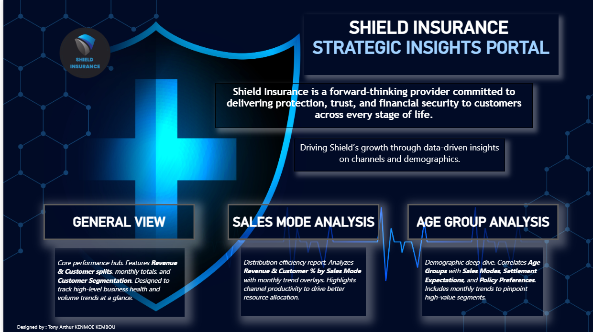
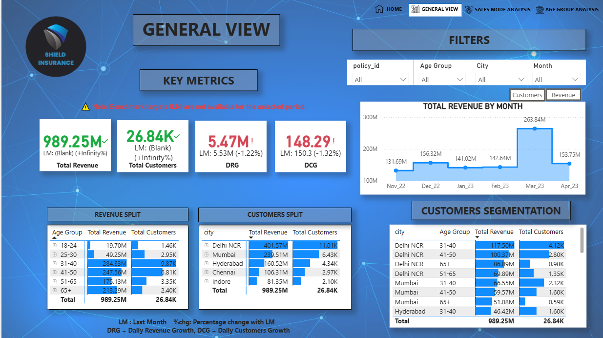

# 🛡️ Shield Insurance: Business Performance Dashboard

A complete business analysis project built as part of the **AtliQ Technologies Virtual Internship (Codebasics DA Bootcamp)**. 

The project focuses on transforming 6 months of business data into clear, interactive insights across revenue, customers, cities, sales modes, and age groups.

🔗 **[LinkedIn Presentation & Video](#)** *(Insert your LinkedIn post link here after publishing)*

---

## 📁 Project Overview
Shield Insurance is a customer-focused insurance provider operating across major Indian metro cities. This analysis focused on:
* **Overall business performance** (Revenue & Customer trends).
* **City-wise insights** (Geographical concentration).
* **Sales mode performance** (Offline vs. Digital).
* **Age group behaviour** (Risk vs. Profitability).
* **Growth opportunities & risks identification**.

---

## 📸 Dashboard Pages & Screenshots

### 1. General View
*A complete business snapshot showing total revenue ($989M), customers (26.8K), and monthly trends.*

### 2. Sales Mode Analysis
*A channel performance view comparing Offline-Agents vs. Digital (Online-App) acquisition.*
*(Insert your screenshot here)*

### 3. Age Group Analysis
*Demographic analysis showing revenue distribution and expected settlements ($176M for the 31-40 group).*

*(Insert your screenshot here)*

---

## 🔍 Key Insights
* **Peak Performance:** **March 2023** was the strongest month for both revenue and customer acquisition.
* **Market Dominance:** **Delhi NCR** is the primary engine, followed by Mumbai (together driving ~65% of revenue).
* **The Adult Paradox:** The **31–40 age group** is the top revenue driver ($284M) but also carries the highest settlement costs ($176M).
* **Digital Shift:** Digital channels show strong growth potential, offering a key lever to reduce commission costs.
* **The Senior Goldmine:** **65+ customers** represent the healthiest segment with an optimal claim-to-premium ratio.
* **Future Growth:** **Indore** and the **18–30 age group** show the highest long-term growth potential for digital products.

---

## 🚀 Strategic Recommendations
1. **Price Adjustment:** Adjust premiums for the 31-40 segment to cover high settlement expenses.
2. **Digital Migration:** Shift the 18-30 segment toward the **Online-App** to minimize management costs.
3. **Tier-2 Expansion:** Replicate success in emerging cities like **Surat and Lucknow** to dilute concentration risk.
4. **Direct Sales:** Push "Direct" sales for simple products to eliminate intermediary commissions.
5. **Senior Loyalty:** Launch specific retention programs for the 65+ segment to balance the overall risk profile.

---

## 🛠️ Tech Stack
* **Power BI** (Data Visualization & Reporting)
* **Power Query** (Data transformation & Cleaning)
* **Microsoft PowerPoint** (Professional Presentation & Storytelling)
* **OBS Studio** (Video Recording)

---

## 📚 Learnings
* Converting business needs into visual insights for executive decision-making.
* Designing dashboards aligned with stakeholder expectations.
* Extracting meaningful patterns from raw datasets.
* Communicating technical analytics through structured business storytelling.

---
*Internship Project for Codebasics - Mentors: @Dhaval Patel & @Hemanand Vadivel*
