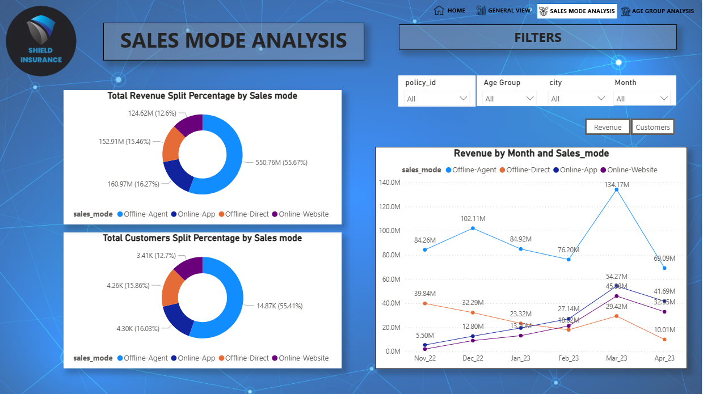
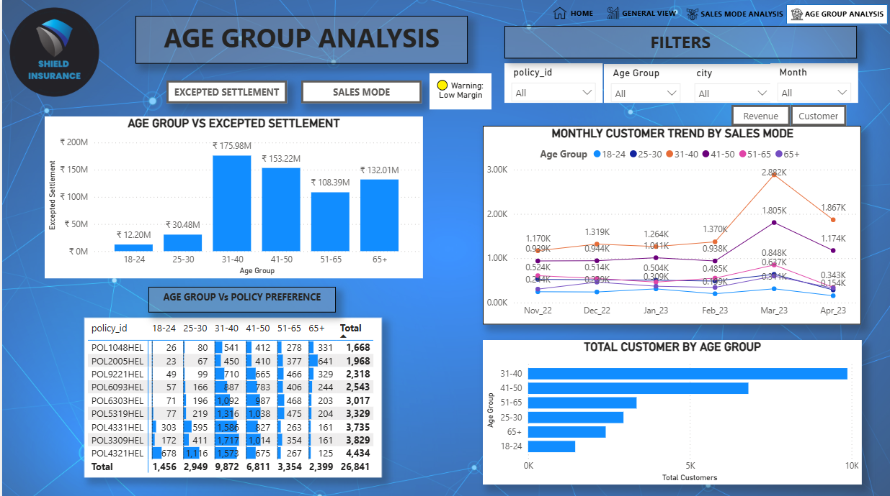

# 🛡️ Shield Insurance: Strategic Performance & Risk Analysis

A comprehensive business intelligence project developed during the **AtliQ Technologies Virtual Internship**. This dashboard transforms 6 months of raw insurance data into actionable executive insights to drive revenue growth and digital transformation.

---

## 📌 Project Objectives

Acting as a Strategic Data Analyst, I was tasked with exploring hospital admissions, policy demographics, and billing patterns to solve key business challenges:
* **Revenue Drivers:** Identify why March 2023 peaked and how to replicate that success.
* **Geographical Insights:** Analyze why Delhi NCR and Mumbai contribute ~65% of the total revenue.
* **Risk Assessment:** Evaluate the settlement patterns of the 31-40 age group ($176M in expected claims).
* **Channel Optimization:** Compare high-commission Offline Agents against high-growth Digital App/Online modes.

---

## 📊 Dashboard Architecture

| Page | Description | Key KPIs |
| :--- | :--- | :--- |
| **🏠 Home** | Professional navigation hub with easy access to all modules. | Navigation Buttons |
| **📊 General View** | High-level performance overview for executive stakeholders. | Total Revenue, Total Customers |
| **📈 Sales Mode** | Breakdown of performance by acquisition channel. | Sales Mode Split, Growth % |
| **👥 Age Group** | Deep dive into demographic risks and customer segments. | Settlement vs Premium |

---

## 📸 Dashboard Visuals

### 🏠 Home Page & Navigation

### 📊 1. General Business View
*Focus on overall trends and city-wise performance.*

### 📈 2. Sales Mode & Channel Analysis
*Evaluating the shift from Offline to Digital channels.*

### 👥 3. Age Group & Risk Analysis
*Deep dive into demographic profitability and settlement costs.*

---

## 🔍 Strategic Key Insights

* **The Growth Engine:** Delhi NCR & Mumbai are the primary revenue hubs, suggesting a need for regional diversification in Tier-2 cities.
* **The Settlement Peak:** The **31–40 age segment** is the highest revenue contributor ($284M) but also carries the highest settlement risk ($176M).
* **Digital Transformation:** Digital channels (App/Online) show a **30% contribution**, offering a massive opportunity to reduce agent commission costs.
* **Market Seasonality:** Performance peaked in **March 2023**, indicating high seasonal demand for policy renewals.

---

## 🚀 Strategic Recommendations

1. **Dynamic Pricing:** Adjust premiums for the 31-40 segment to better balance high settlement outflows.
2. **Digital Migration:** Incentivize the 18-30 segment to use the **Online App** for lower acquisition costs.
3. **Regional Expansion:** Replicate the Delhi/Mumbai success model in emerging markets like **Surat and Lucknow**.
4. **Direct Sales Push:** Develop "Direct-to-Customer" simple products to bypass intermediary commissions.

---

## 🛠️ Tech Stack & Skills
* **Power BI Desktop:** Advanced Data Modeling & Visualization.
* **Power Query:** ETL processes (Cleaning & Transforming data).
* **DAX:** Complex measures for growth rates and business KPIs.
* **Storytelling:** Converting technical metrics into strategic business recommendations.

---
*Internship Project for Codebasics - Mentors: @Dhaval Patel & @Hemanand Vadivel*
